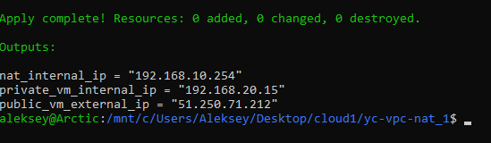
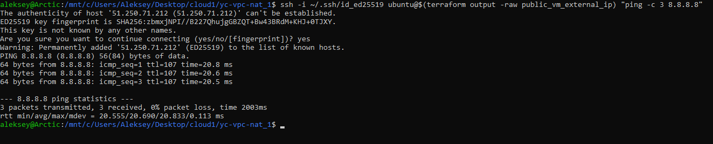
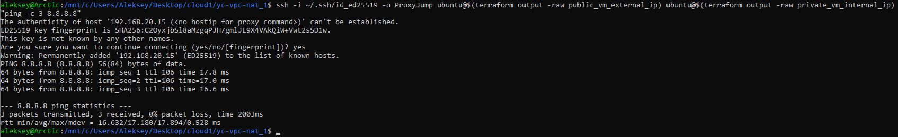

# Домашнее задание к занятию «Организация сети»

---

## Файлы проекта

- [`main.tf`](yc-vpc-nat_1/main.tf) - основные ресурсы инфраструктуры
- [`providers.tf`](yc-vpc-nat_1/providers.tf) - настройка провайдеров (Yandex Cloud, Time)
- [`variables.tf`](yc-vpc-nat_1/variables.tf) - объявление переменных
- [`outputs.tf`](yc-vpc-nat_1/outputs.tf) - выходные значения (IP-адреса)

`terraform.tfvars` - значения переменных

## Документация

## Комментарии

- В файле main.tf используется ресурс time_sleep.wait_for_nat с задержкой 180 секунд (3 минуты) между созданием NAT-инстанса и Public VM.

- Причина:
Yandex Cloud действует ограничение (rate limit) на частоту создания публичных IP-адресов - vpc.externalAddressesCreation.rate. При попытке создать две ВМ с публичными IP одновременно API возвращает ошибку:

### RESOURCE_EXHAUSTED: Quota limit vpc.externalAddressesCreation.rate exceeded

